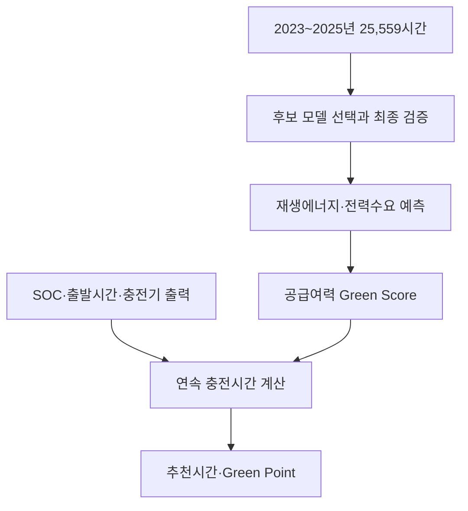

# 팀원 설명서 — JEJU Green Time

## 한 문장 소개

제주 개인 전기차 사용자가 현재 배터리와 출발시간을 입력하면, AI가 재생에너지 발전량과 제주 전력수요를 예측해 공급여력이 높은 연속 충전시간과 Green Point 혜택을 계산합니다.

## 해결하는 문제

- 사용자는 언제 재생에너지 공급여력이 높은지 알기 어렵습니다.
- 발전량이 많아도 같은 시간의 제주 전력수요가 더 크면 좋은 시간이 아닐 수 있습니다.
- 출발 전까지 목표 배터리를 채워야 합니다.
- 예보 오차를 고려해야 합니다.
- 사용자가 충전시간을 옮길 동기가 필요합니다.

## 전체 흐름



## 데이터

한 행은 제주도의 한 시간을 뜻합니다.

- 기존 데이터: 2025년 8,760시간
- 추가 데이터: 2023~2024년 16,799시간
- 최종 학습 데이터: 25,559시간
- 공식 제주 전력수요: 25,559시간 전부 병합
- 날씨 입력: 기온, 습도, 풍속, 일사량
- 재생에너지 정답: 태양광+풍력 발전량
- 수요 정답: 제주 계통수요

2023년 12월 발전 원본과 2023-01-26 00시 풍력 결측은 임의로 만들지 않았습니다.

## 모델과 검증

- 재생에너지: HistGradientBoosting 기반 예측
- 제주 전력수요: LightGBM 기반 예측
- 여러 모델 후보를 앞쪽 4개 시간 구간에서 비교
- 마지막 30일은 모델 선택에 사용하지 않고 최종 시험에만 사용
- 연도 경계나 원본 누락 구간을 가로지르는 잘못된 lag 생성 차단

| 대상 | 최종 MAE | 월·시간 기준 MAE | 개선율 |
|---|---:|---:|---:|
| 재생에너지 | 37.353MWh | 39.297MWh | 4.95% |
| 제주 전력수요 | 22.4568MWh | 41.9477MWh | 46.46% |

- 공급여력 MAE: AI 0.053125, 기준 0.056906
- Green Time 상위 30% 일치율: AI 92.13%, 기준 92.13%

재생에너지 개선 폭은 작고 상위 30% 일치율은 기준과 같으므로 과장하지 않습니다. MAE는 정확도 백분율이 아니며 오차가 0이라는 뜻도 아닙니다.

## Green Score

```text
재생에너지 공급여력 = 예측 재생에너지 발전량 ÷ 예측 제주 전력수요
Green Score = 공급여력을 과거 분포와 비교한 백분위 점수
```

예를 들어 70점은 해당 공급여력이 과거 비교 구간의 약 70%보다 높다는 뜻입니다. 점수가 높다고 그 시간의 전기가 100% 재생에너지라는 뜻은 아닙니다.

보수적 추천에는 재생에너지 예상 하한과 전력수요 예상 상한을 사용합니다. 점수가 같으면 더 이른 시간을 선택하며 다른 가격 지표로 순위를 바꾸지 않습니다.

## 충전시간과 Green Point

필요 충전량은 다음처럼 계산합니다.

```text
배터리에 채울 양 = 배터리 용량 × (목표 SOC - 현재 SOC)
전력망에서 받을 양 = 배터리에 채울 양 ÷ 충전 효율
```

사용 가능한 시간 안에서 목표 SOC를 만족하는 가장 높은 점수의 연속 구간을 찾습니다. 시간이 부족하면 가능한 도달 SOC와 함께 불가능 경고를 표시합니다.

Green Point는 실제 지급이 아닌 정책 시뮬레이션입니다.

- 월 캠페인 예산: 3,000,000원
- 목표 이동 충전량: 100,000kWh
- 최대 단가: 30P/kWh
- 참여 보장: 10P/kWh
- 성과 보너스: 점수에 따라 0·10·20P/kWh
- 한 세션 상한: 1,500P

실제 지급에는 충전사업자 또는 지자체와의 계약, 충전 세션 ID, 결제기록, 중복지급 방지 원장과 예산 정산이 필요합니다.

## 실시간 보정

공공데이터포털 인증키가 있으면 KPX 제주계통운영정보 API의 5분 태양광·풍력 관측을 연결합니다.

1. 5분 MW 12개를 합쳐 한 시간 MWh로 변환합니다.
2. 최근 완료 3시간의 실제값과 예측값 차이를 계산합니다.
3. 아직 지나지 않은 재생에너지 예측만 보정합니다.
4. 가까운 시간에 크게, 먼 시간에 작게 반영합니다.
5. 재생에너지·수요 공급여력으로 Green Score와 충전계획을 다시 계산합니다.

미래 실제값은 화면, 추천, 포인트 정산과 점수 기준에서 차단합니다. 과거 발표 예보 원본이 아닌 관측날씨 재현이므로 실제 당시 기상예보 오차는 포함하지 않습니다.

## 검증 완료 항목

- 데이터 검사 통과
- AI 추천·SOC·포인트 검사 통과
- 단위테스트 39개 통과
- Streamlit AppTest 실행 오류 0개
- GitHub Actions 전체 단계 성공
- 모델·데이터 파일 SHA 무결성 검사 통과
- PR 병합 가능 상태 확인

## 발표할 때 지킬 표현

말해도 되는 표현:

- “25,559시간의 시간별 데이터를 사용했습니다.”
- “마지막 30일은 모델 선택과 분리해 최종 시험에만 사용했습니다.”
- “Green Score는 예측 재생에너지 발전량을 예측 제주 전력수요로 나눈 공급여력 기준입니다.”
- “Green Point는 예산 기반 정책 시뮬레이션입니다.”

피해야 하는 표현:

- “AI를 25,559시간 돌렸습니다.”
- “AI 정확도가 95%입니다.”
- “무조건 전기요금이 절약됩니다.”
- “탄소감축이 공식 인증됐습니다.”
- “실제 충전기와 포인트 지급이 이미 연결됐습니다.”

## 현재 상태

최종 작업 브랜치는 `agent/upgrade-ai-pipeline`, 초안 PR은 #6입니다. 데이터와 기능 통합은 끝났고 `main`에는 아직 병합하지 않았습니다.
