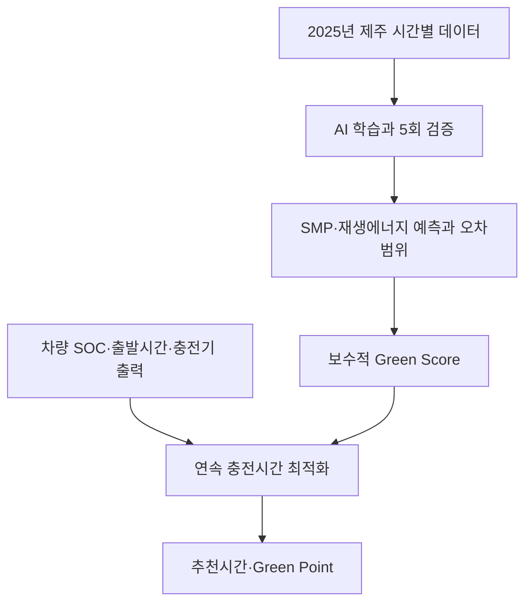
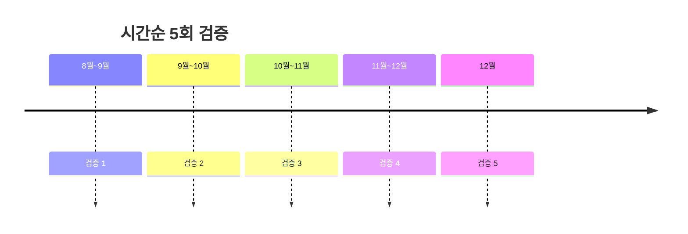

# 팀원에게 설명하기 위한 완전 쉬운 해설

이 문서는 코드를 모르는 사람도 프로젝트의 논리, AI, Green Point, 한계를 설명할 수 있도록 만든 발표자용 교과서입니다.

## 0. 먼저 외울 한 문장

> 제주 개인 전기차 사용자가 현재 배터리와 출발시간을 입력하면, AI가 재생에너지 발전량과 SMP 보조지표를 예측해 충전하기 좋은 연속 시간대를 추천하고 Green Point 혜택을 계산합니다.

## 1. 우리가 해결하는 문제

전기차 사용자는 보통 `지금 충전할까, 나중에 충전할까?`를 판단하기 어렵습니다.

- 언제 재생에너지 발전이 많을지 모릅니다.
- 언제 제주 전력시장의 도매가격 지표가 낮을지 모릅니다.
- 출발 전까지 필요한 배터리는 반드시 채워야 합니다.
- 예보가 틀릴 수도 있습니다.
- 친환경 시간에 충전하라고 말만 하면 사용자가 기다릴 이유가 없습니다.

그래서 시스템은 세 가지를 함께 해결합니다.

1. 미래 조건을 예측합니다.
2. 사용자의 시간·배터리 조건을 지키며 충전시간을 계산합니다.
3. 행동할 이유가 되도록 Green Point를 계산합니다.

여기서 `친환경`과 `가격절약`은 서로 다른 장치가 담당합니다.

- 친환경 시간 선택: 재생에너지 발전량 예측이 중심입니다.
- 사용자 가격 혜택: Green Point가 담당합니다.
- SMP: 소비자 요금이 아니라 전력시장 상황을 보조하는 지표입니다.

## 2. 전체 흐름



## 3. 어려운 단어를 아주 쉽게

| 단어 | 쉬운 뜻 | 이 프로젝트에서 하는 일 |
|---|---|---|
| AI 모델 | 과거 표에서 숫자 관계를 배워 새 숫자를 맞히는 프로그램 | 다음 시간대의 SMP와 재생에너지 발전량 예측 |
| 특성 | AI에게 주는 힌트 | 시간, 요일, 날씨, 하루 전 값 등 |
| 정답값 | AI가 맞혀야 하는 숫자 | 실제 SMP, 실제 재생에너지 발전량 |
| SMP | 전력시장의 시간별 도매가격 지표 | 가격이 낮을 가능성이 있는 시간 판단에 사용 |
| SOC | 전기차 배터리 잔량 비율 | 필요한 충전량 계산에 사용 |
| kW | 충전 속도 | 7kW 충전기는 한 시간에 최대 약 7kWh 공급 |
| kWh | 충전한 전기의 양 | 비용과 Green Point 계산의 기준 |
| MWh | 발전량 단위, 1MWh=1,000kWh | 제주 전체 재생에너지 발전량 표시 |
| MAE | 예측이 평균적으로 얼마나 빗나갔는지 | 모델 성능 판단. 작을수록 좋음 |
| 기준 모델 | AI와 겨루는 단순한 방법 | 하루 전, 일주일 전 값으로 예측 |
| 백테스트 | 과거의 일부를 미래라고 가정해 시험 | 모델이 처음 보는 기간에서도 작동하는지 검사 |
| 데이터 누수 | 미래 정답을 힌트로 몰래 쓰는 실수 | 시간순 검증과 과거 시차만 사용해 방지 |
| 예측 범위 | 예측값이 흔들릴 수 있는 폭 | 틀릴 가능성을 화면에 표시 |
| 최적화 | 조건을 지키며 가장 나은 선택을 찾는 계산 | 목표 SOC·출발시간을 지키는 충전구간 선택 |

## 4. 데이터가 AI로 들어가는 방법

한 행은 제주도의 한 시간을 뜻합니다.

예를 들어 2025년 7월 10일 14시 한 행에는 다음 숫자가 있습니다.

- 기온
- 습도
- 풍속
- 일사량: 햇빛 에너지의 세기
- 실제 SMP
- 실제 태양광 발전량
- 실제 풍력 발전량

AI에게 추가로 알려주는 과거 정보:

- 24시간 전 같은 시각의 SMP와 재생에너지
- 168시간 전, 즉 일주일 전 같은 시각의 SMP와 재생에너지

예측하려는 시각보다 이미 지나간 값만 사용하므로 미래 정답을 미리 보는 데이터 누수가 아닙니다.

## 5. AI 모델이 두 개인 이유

### SMP 모델

SMP는 시장과 계통상황 때문에 갑자기 튈 수 있습니다. 따라서 AI가 처음부터 전부 맞히게 하지 않습니다.

1. 하루 전과 일주일 전 값의 평균을 기본 답으로 정합니다.
2. Extra Trees가 기본 답이 어느 방향으로 틀리는지 학습합니다.
3. AI 보정값의 75%만 반영합니다.

쉽게 말하면 `경험 많은 기본 계산 + AI의 조심스러운 수정`입니다.

### 재생에너지 모델

태양광과 풍력은 시간·햇빛·바람과 관계가 비교적 큽니다. HistGradientBoosting 모델이 이런 관계를 직접 학습합니다.

모델 이름을 외울 필요는 없습니다. 발표에서는 다음처럼 말하면 됩니다.

> SMP는 강한 과거 기준을 AI가 보정하고, 재생에너지는 시간과 날씨 관계를 AI가 직접 학습합니다.

## 6. 모델을 어떻게 정직하게 시험했나

처음 버전은 1년의 마지막 20%를 한 번만 시험했습니다. 이 방법도 틀리지는 않지만, 특정 계절에 우연히 잘했을 가능성이 있습니다.

강화본은 서로 다른 다섯 기간에서 각 30일을 시험했습니다.



중요한 규칙은 `시험 날짜보다 앞선 데이터로만 학습`하는 것입니다.

### 결과

| 대상 | AI 평균오차 | 가장 강한 단순 기준 | AI 개선율 |
|---|---:|---:|---:|
| SMP | 10.7418원/kWh | 11.2154 | 4.22% |
| 재생에너지 | 10.9011MWh | 15.7213 | 30.66% |

설명 방법:

> SMP는 이미 강한 과거 기준이 있어서 AI 개선폭은 4.22%로 작지만 실제로 더 나았습니다. 재생에너지는 날씨와 시간 정보를 활용해 단순 기준보다 30.66% 좋아졌습니다.

절대 `AI가 95% 정확하다`고 말하지 않습니다. 현재 계산한 지표는 정확도 백분율이 아니라 평균오차와 기준 대비 개선율입니다.

## 7. 예보가 틀리면 어떻게 하나

예측값 하나만 믿으면 위험합니다. 예를 들어 내일 맑다고 예측했지만 실제로 비가 오면 태양광 발전이 줄 수 있습니다.

그래서 과거 오차를 사용해 예상 범위를 만듭니다.

- SMP 예측값이 100이면 대략 `100 ± 24.58` 범위를 함께 봅니다.
- 재생에너지 예측값이 80이면 대략 `80 ± 33.25` 범위를 함께 봅니다. 하한은 0보다 작아지지 않게 합니다.

충전시간을 정할 때는 유리한 중심값이 아니라 불리한 경우를 사용합니다.

- SMP는 비싸질 수 있는 상한값
- 재생에너지는 줄어들 수 있는 하한값

이것이 `보수적 planning_score`입니다.

실제 서비스로 발전하면 하루 전, 당일 아침, 충전 한 시간 전에 예보를 다시 받아 아직 충전하지 않은 시간만 재계산해야 합니다. 현재 MVP는 Open-Meteo의 제주시 내일 예보를 30분마다 다시 받을 수 있습니다.

그리고 `실시간 보정 재현`도 구현했습니다. 공식 제주 실시간 발전량 API가 아직 연결되지 않았기 때문에 과거 실제값을 선택한 현재 시각까지만 한 시간씩 공개합니다. 최근 3시간의 `실제값-예측값` 평균으로 이후 예측을 고치고 Green Score와 충전시간을 다시 계산합니다. 가까운 시간은 많이 고치고 먼 시간은 적게 고칩니다. 미래 실제값은 화면·계획·포인트 정산과 Green Score의 비교 기준에서 미리 보지 못하도록 코드와 자동검사에서 차단했습니다.

실제 5분 단위 발전량을 받으면 MW와 MWh를 구분해야 합니다. 실시간 화면의 MW는 순간 발전 세기이고, 현재 모델의 MWh는 한 시간 동안 생산한 전기의 양입니다. 코드에는 `MW × 5/60`을 12개 합쳐 시간별 MWh로 바꾸고, 12개 중 몇 개가 도착했는지 확인하는 변환 함수도 준비했습니다.

## 8. Green Score는 무엇인가

Green Score는 두 기회를 0~100점으로 바꿔 합친 내부 추천점수입니다.

```text
Green Score
= 재생에너지 기회점수 × 80%
+ SMP 시장기회점수 × 20%
```

- 재생에너지 기회점수: 과거 2025년과 비교해 발전량이 많을수록 높음
- SMP 시장기회점수: 과거 2025년과 비교해 SMP가 낮을수록 높음

재생에너지를 80%로 둔 이유는 Green Score를 `친환경 시간 선택 점수`로 명확하게 만들기 위해서입니다. 사용자 가격 혜택은 이 점수에 억지로 섞지 않고 Green Point로 따로 제공합니다. 80:20은 법이나 과학의 정답이 아니라 해커톤 MVP의 운영정책입니다.

Green Score가 높다고 `그 시간의 전기가 100% 재생에너지`라는 뜻은 아닙니다.

## 9. 충전량 계산

기본 예시:

- 현재 SOC: 30%
- 목표 SOC: 80%
- 배터리: 60kWh
- 충전 효율: 90%

배터리에 실제로 채워야 할 양:

```text
60kWh × (80%-30%) = 30kWh
```

충전 중 손실을 포함해 전력망에서 받아야 할 양:

```text
30kWh ÷ 0.9 = 33.33kWh
```

7kW 충전기라면 약 4.76시간이 필요하므로 한 시간 단위 데이터에서는 5개의 연속 시간칸을 선택하고 마지막 시간은 필요한 양만큼만 충전합니다.

목표시간 안에 채울 수 없으면 시스템은 거짓으로 성공이라고 하지 않고 `불가능` 경고와 가능한 도달 SOC를 표시합니다.

## 10. Green Point 구조가 왜 논리적인가

가장 먼저 알아야 할 사실:

> SMP가 낮거나 재생에너지가 많다고 소비자 충전요금이 자동으로 내려가지는 않습니다.

따라서 포인트는 자동으로 생기는 돈이 아닙니다. 다음 중 한 곳이 캠페인 예산을 제공해야 합니다.

- 충전사업자: 한산한 시간으로 수요를 이동시키는 마케팅 비용
- 렌터카 회사: 고객 혜택과 차량 충전 스케줄 관리 비용
- 제주도·공공기관: 재생에너지 수용과 실증사업 예산
- ESG 후원기업: 친환경 행동 캠페인 비용

### 두 단계 Green Point

```text
최종 Green Point
= 참여 보장분
+ 실제 성과 보너스
```

### 단가를 정하는 근거

```text
최대 P/kWh
= 월 캠페인 예산 ÷ 월 목표 Green Time 충전량 ÷ 1원/P

기본 가정
= 3,000,000원 ÷ 100,000kWh
= 30P/kWh
```

이 30P 중 10P는 행동에 대한 보장분, 나머지 최대 20P는 실제 성과에 배분합니다. 따라서 사용자가 화면에서 보상 단가를 임의로 정하지 않습니다.

#### 참여 보장분

```text
추천시간을 따른 실제 충전량 × 10P/kWh
```

예보가 틀려도 사용자는 시스템의 요청을 따랐으므로 돌려받지 않습니다.

#### 실제 성과 보너스

```text
실제 Green Score 50점 미만: 0P/kWh 추가
실제 Green Score 50~69점: 10P/kWh 추가
실제 Green Score 70점 이상: 20P/kWh 추가
```

충전이 끝난 뒤 실제 발전·가격 데이터가 확인된 경우에만 지급합니다.

기본 재현 실험:

| 항목 | 결과 |
|---|---:|
| 총 충전량 | 33.33kWh |
| 참여 보장분 | 약 333P |
| 실제 성과 보너스 | 약 667P |
| 총 재현 정산 | 1,000P |

한 번 충전당 총 포인트는 1,500P를 넘지 않습니다. `1P=1원`은 다음 충전에서 1원처럼 사용하는 크레딧이라는 정책 가정이며, 실제 제휴 전에는 지급액이라고 말하면 안 됩니다. `월 예산과 목표 충전량을 가정한 과거 재현 결과`라고 설명합니다.

## 11. 실제 포인트 지급에 추가로 필요한 것

현재 코드만으로 실제 돈을 지급할 수는 없습니다. 실제 사업에는 다음 자료가 필요합니다.

1. 사용자가 추천을 수락한 기록
2. 충전소 ID와 충전기 ID
3. 충전 세션 ID
4. 충전 시작·종료시간
5. 실제 충전량 kWh
6. 결제 완료 기록
7. 같은 충전에 두 번 지급하지 않았다는 원장
8. 포인트 예산 제공자와 정산계약

현재는 이 구조를 숫자로 시뮬레이션한 MVP입니다.

## 12. 파일별 역할

| 파일 | 하는 일 |
|---|---|
| `scripts/prepare_data.py` | 여러 원본 표를 시간 기준으로 합침 |
| `scripts/validate_data.py` | 결측값·중복·범위 검사 |
| `scripts/model_utils.py` | AI 입력 특징과 점수 계산 |
| `scripts/train_models.py` | 5회 백테스트, 모델 학습, 예측범위 생성 |
| `scripts/live_forecast.py` | 제주시 내일 날씨예보와 실험용 예측 생성 |
| `scripts/realtime_adjustment.py` | 도착한 실측 오차로 미래 예측을 고치고 5분 MW를 시간별 MWh로 변환 |
| `scripts/optimizer.py` | SOC·시간·출력 조건을 지키는 충전구간 계산 |
| `scripts/validate_ai.py` | 결과파일과 기본 시나리오 자동검사 |
| `tests/test_optimizer.py` | 포인트와 최적화의 핵심 규칙 9개 검사 |
| `tests/test_realtime_adjustment.py` | 미래 실제값 차단·보정 방향·단위 변환 5개 검사 |
| `app.py` | 사용자가 보는 Streamlit 화면 |
| `MODEL_CARD.md` | 모델 성능·한계 기록 |
| `.github/workflows/test.yml` | GitHub에 올릴 때 자동으로 전체 검사 |

## 13. 데모 진행 순서

1. `검증된 과거 재현`에서 기본값 SOC 30%→80%, 출발 20시를 보여줍니다.
2. 추천시간이 연속 구간으로 나오고 목표 SOC가 지켜지는 것을 보여줍니다.
3. 재생에너지 80%, SMP 20%이며 SMP는 보조지표라고 말합니다.
4. 예측값과 실제값, 보수적 예상범위를 보여줍니다.
5. 참여 보장 333P와 실제 성과 보너스 667P가 분리된 것을 보여줍니다.
6. `실시간 보정 재현`에서 현재 시각 슬라이더를 움직여 보정 전·후 예측과 추천시간 변화를 보여줍니다.
7. 이것은 공식 실시간 API가 아니라 과거 실측 순차 재생이라고 밝힙니다.
8. `내일 예보 실험`으로 바꾸어 실제 기상예보 API 기반 24시간 화면을 보여줍니다.
9. 미래 모드의 보너스는 충전 후 실제값이 들어와야 정산된다고 설명합니다.
10. 출발시간을 너무 이르게 바꿔 `목표 충전 불가능` 경고를 보여줍니다.
11. 마지막으로 구현·미구현 항목을 공개합니다.

## 14. 30초 발표 대본

> 제주 개인 전기차 사용자는 언제 충전해야 재생에너지 활용에 유리한지 알기 어렵고, 기다려서 충전할 직접적인 혜택도 없습니다. 저희는 AI로 재생에너지 발전량과 SMP 보조지표를 예측해 출발 전 목표 배터리를 지키는 연속 충전시간을 추천합니다. 시간순 5회 검증에서 강한 단순 기준보다 SMP 오차를 4.22%, 재생에너지 오차를 30.66% 줄였습니다. 추천을 따르면 Green Point를 제공하는 정책도 함께 시뮬레이션하며, 내일 날씨예보 API를 이용한 실험 화면도 제공합니다.

## 15. 예상 질문과 답변

### Q. SMP가 낮으면 소비자가 정말 싸게 충전합니까?

아닙니다. SMP는 도매가격 지표이고 소비자 충전단가와 직접 같지 않습니다. 현재 Green Point는 제휴사가 캠페인 예산을 제공한다고 가정한 시뮬레이션입니다.

### Q. 왜 AI가 필요합니까?

하루 전 값만 사용하는 강한 기준과 비교했을 때 AI가 실제로 오차를 줄이는지 검증했습니다. 특히 재생에너지 예측에서 MAE가 30.66% 개선됐습니다.

### Q. SMP 개선율 4.22%면 너무 낮지 않습니까?

비교 기준 자체가 하루 전과 일주일 전 값을 합친 강한 기준입니다. 작은 개선을 큰 성과처럼 과장하지 않습니다. 현재 빠진 전력수요·계통상태 데이터를 추가하면 개선 가능성을 시험할 수 있습니다.

### Q. 내일 비 예보가 틀리면 어떻게 합니까?

현재는 과거 오차로 만든 예상범위의 불리한 값을 사용해 추천합니다. 내일 예보 화면도 30분마다 새로 받을 수 있습니다. 실제 서비스에서는 충전 중에도 예보를 갱신하고 미래의 미충전 구간만 다시 계산해야 합니다. 보장 포인트는 유지하고 성과 보너스만 실제 결과로 정산합니다.

### Q. 환경효과를 증명했습니까?

아직 아닙니다. 재생에너지 발전이 많은 시간으로 이동할 기회를 계산했지만 실제 출력제어 회피량이나 탄소감축량을 공식 검증하지 않았습니다.

### Q. 실제 충전기를 제어합니까?

아닙니다. 현재는 추천과 시뮬레이션입니다. 실제 제어에는 충전사업자의 예약·충전 세션 API와 사용자 동의가 필요합니다.

### Q. 1년 데이터로 충분합니까?

해커톤 MVP를 검증하기에는 사용할 수 있지만 장기 서비스에는 부족합니다. 다음 단계에서는 동일한 정의의 2023~2025 데이터를 연결하고 연도별 설비용량 변화도 반영해야 합니다.

## 16. 마지막으로 꼭 지킬 표현

### 말해도 되는 표현

- `과거 데이터를 이용한 24시간 예측 재현`
- `강한 기준 대비 오차 개선`
- `재생에너지 활용에 유리할 가능성이 높은 시간`
- `Green Point 정책 시뮬레이션`
- `내일 날씨예보 기반 실험 모드`
- `실측 도착에 따른 보정 로직을 과거 데이터로 재현했다`
- `예측 AI와 제약 최적화`

### 말하면 안 되는 표현

- `실제 충전요금을 예측한다`
- `실제 포인트를 지급한다`
- `100% 친환경 전기로 충전한다`
- `탄소를 정확히 몇 kg 줄였다`
- `실시간 제주 전력망을 제어한다`
- `제주 태양광·풍력 실측 API가 현재 연결돼 있다`
- `AI가 미래 날씨를 정확히 맞힌다`

모르는 질문을 받으면 추측하지 말고 다음처럼 답합니다.

> 현재 공개데이터와 MVP 범위에서는 확인하지 못한 부분입니다. 실제 서비스 단계에서 해당 사업자 데이터와 계약을 통해 검증해야 합니다.
